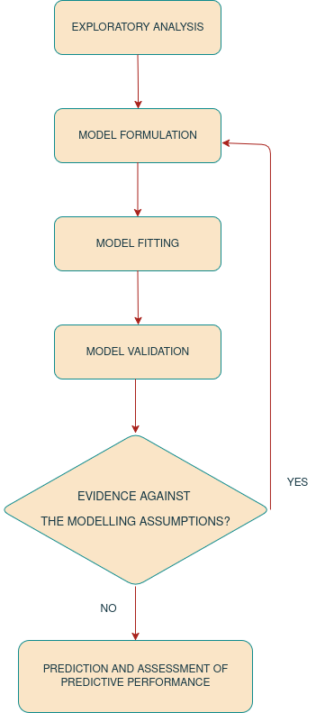

# Introduction

The book shows how to carry out model-based geostatistical analysis of public health data using the `RiskMap` R package. In this introductory chapter, we explain what are the pre-requisites for using this book and its learning objectives. We also explain what software should be installed and how. Finally, we give a brief overview of the class of models covered in this book, and the examples that will be used to illustrate the methods and use of software.

## Objectives of this book

The overall aim of this book is to provide you with the skills to perform a geostatistical analysis of a data-set using the R software environment. As you work your way through the book, you will learn to:

-   explore geostatistical data-sets using graphical procedures and summary statistics;
-   formulate and fit geostatistical models using the maximum likelihood estimation method;
-   carry out prediction of health outcomes at different spatial scales;
-   visualize and interpret the results from geostatistical models;
-   model the relationships between spatially referenced risk factors and the health outcome of interest;
-   validate the assumptions of geostatistical models and assess their predictive performance.

Although the focus of this book is on public health, the statistical ideas, as well as the software used, can also be applied for the analysis of geostatistical data-sets arising from other scientific fields.

## Pre-requisites for using this book

To effectively understand and use the material presented in this book, it is expected that you should possess prior knowledge of basic probability theory, foundational topics in statistical modelling and R programming. Below we provide a more detailed explanation of the pre-requisites for each of these three fields.

### Topics in probability

Basics probability theory is important to fully understand the content of this book. In particular, you should have knowledge of: the general definition and properties of continuous and discrete distribution; how the describe the properties of probability distributions through their mean, variance and skeweness; the concepts of stochastic dependence and correaltion; the distinction between marginal and conditional distributions; the basic properties of the Gaussian, Binomial and Poisson distributions; the definition and properties of the multivariate Gaussian distribution. The redear can find an extensive explanation and illustrations with examples of all these topics in @ross2013.

### Topics in statistics

Likelihood-based inference (whether frequensist or Bayesian) provides the theoretical bedrock for the estimation of almost any statistical model. In this book will focus on maximum likelihood estimation methods of inference. Extensive use of the notions of point and interval estimates obtained using the maximum likelihood estimation methods will be made through the book. Recommended readings include chapters 1, 2 and 4 of @pawitan2001.

Good prior knowledge of Generalized linear models (GLMs) is essential, as the geostatistical modelling framework builds on these as an extension. Before embarking on the use of this book, we thus encourage you to review the basic theory of GLMs and, in particular, how these are applied and interpreted. In this book, we will cover examples that will model continuously measured outcomes and counts. Hence, good understanding of linear regression modelling and modelling of counts data using Binomial and Poisson regression should be the main focus of the review. For comprehensive overview of GLMs and their implementation in R, we refer you to @dobson2008.

### Topics in R programming

Although this book does not require to possess advanced skills in R programming, it is important you have good knowledge in the following topics: creation and manipulation of vectors and matrices; logical vectors; character vectors; handling of lists and data frame objects; reading data into R; graphical procedures. A very large amount of freely available material covering these topics can be found online. Our recommendation is to start from the manual "An introduction to R" of the Comprehensive R Archive Network available at this link, available at [R manual](https://cran.r-project.org/manuals.html).

## Obtaining and running the R packages

It is advised that you obtain the latest 64-bit version of R in order to run the R code of this book. To install R, go to the R website, where you can download the installer packages for Windows and Mac, and find instructions for Linux, using binary files.

-   [Windows](https://cran.r-project.org/bin/windows/base/)
-   [Mac](https://cran.r-project.org/bin/macosx)
-   [Linux](https://cran.r-project.org/bin/linux)

The list of the R packages used in this book is provided in @tbl-packages.

| R packages | Used for |
|------------------------------------|------------------------------------|
| `RiskMap` (E) | Estimating of geostatistical models and spatial prediction |
| `sf` (E) | Handling of spatial data in R |
| `terra` (E) | Handling of raster files in R |
| `ggplot2` (E) | Creating maps and exploratory plots |
| `crsuggest` (R) | Guessing a coordinate reference systems when unknown |

: List of the R packages that will be used in the book with a description of their use in the data analysis. The packages marked by (E) are essential for the geostatistical analysis. Those instead marked by (R) are recommended and can be helpful to overcome issues as described under the column "Used for". {#tbl-packages}

To install packages in R for the first time, you can use the command `install.packages` in the R console, as shown below for the `RiskMap` package.

```{r eval=FALSE}
install.packages("RiskMap")
```

## Data-sets used in the book {#sec-examples-ch1}

The geostatistical data-sets described in this section will be used throughout the book to illustrate the use of the R packages mentioned in the previous sections.

Each of the examples data-sets can be loaded from the `RiskMap` package, using the command

```{r eval=FALSE}
data(NAME_OF_THE_DATASET)
```

where in place of `NAME_OF_THE_DATASET` you should type of the name of one of the data-sets listed in @tbl-data-sets.

| Names of the data-set | Short description | Used in this book as |
|------------------------|------------------------|------------------------|
| `galicia` | Lead concentration m from moss samples collected in Galicia, Northern Spain | Example |
| `liberia` | Prevalence data on river-blindness from Liberia | Example |
| `malkenya` | Malaria prevalence data from a community and school survey conducted in Western Kenya | Example |
| `italy_sim` | Simulated geostatistical data-set within the Italian national boundaries | Example |
| `malnutrition` | Data on stunting among children in Ghana | Case study |

: List of data-sets available from the `RiskMap` package. Data-sets listed as "Example" are used throughout the book to illustrate the use of R functions. Data-sets listed as "Case study" are analysed in @sec-case-studies. {#tbl-data-sets}

### Lead concentration in Galicia

::: {#fig-galicia-ch1}
```{r}
#| echo: false

if(knitr::is_html_output()){
  knitr::include_url("figures/galicia_ch1.html")
} else {
  knitr::include_graphics("figures/galicia_ch1.png")
}
```

Data on the measured lead concentration (in micrograms per gram dry weight) in moss samples collected in Galicia, North-West of Spain.
:::

Lead is a heavy metal which, in high concentrations, can cause chronic damage to living organisms over a long period of time. For this reason its spread and source must be regularly monitored. To assess the extent of the contamination in an area, measurements of lead are often taken from plants. The data here considered (@fig-galicia-ch1) consist of 132 locations of moss samples collected in 2000, in and around Galicia, a region in the North-Western part of Spain. One of the objectives of this survey was to establish the spatial pattern of lead concentration in Galicia so as to better identify possible sources of contamination; fore more information, see @fernandez2000.

In this case, geostatistical modelling can be used to predict the lead concentration across Galicia and allows to disentangle variation which is purely random, possibly due to measurement error, and genuine spatial variation, which is our main object of interest.

This data-set will be used in this book to show how to carry out the spatial analysis of continuously measured variables using linear geostatistical models.

### River-blindness in Liberia {#sec-rb-ch1}

::: {#fig-liberia-ch1}
```{r}
#| echo: false

if(knitr::is_html_output()){
  knitr::include_url("figures/liberia_ch1.html")
} else {
  knitr::include_graphics("figures/liberia_ch1.png")
}
```

River-blindness data from a cross-sectional survey carried out in Liberia.
:::

In low-resource settings, where disease registries are typically absent, cross-sectional surveys are an essential monitoring tool that enables the estimation of the disease burden in a population of interest. The data considered in this example (@fig-liberia-ch1) have been collected as part of an Africa-wide initiative called the Rapid Epidemiological Mapping of Onchocerchiasis (REMO) carried out in 2011 in 20 African countries [@zoure2014]. The goal of REMO is to identify areas where river-blindness (or onchocerchiasis), a disease transmitted by black flies who breed along fast flowing rivers, is still a public health problem. In this context, it is especially of interest to identify communities with a prevalence above 20% where treatment is urgently needed.

In this book, we will use data collected from Liberia to model nodule prevalence, which is based on a alternative and cheaper diagnostic technique for river-blindness. In the analysis of this data-set, we will illustrate how to formulate and fit Binomial geostatistical models, and how these can be used to predict prevalence within a region of interest.

### Malaria in the Western Kenyan Highlands {#sec-malaria-ch1}

::: {#fig-malkenya-ch1}
```{r}
#| echo: false

if(knitr::is_html_output()){
  knitr::include_url("figures/malkenya_ch1.html")
} else {
  knitr::include_graphics("figures/malkenya_ch1.png")
}
```

Malaria prevalence data from a cross-sectional survey carried out in Nyanza Province, in the Western Highlands of Kenya.
:::

Malaria is one of deadliest diseases that affects populations living in tropical and subtropical countries. It is caused by a parasite of the genus Plasmodium which is transmitted through the infectious bite of female Anopheles mosquitoes. In the following chapters, we shall analyse a data-set (@fig-malkenya-ch1) from a cross-sectional community survey carried out in July 2010 in Nyanza Province, in the Western Highlands of Kenya [@stevenson2013].

What distinguishes this from the other examples data-sets is that the data contain both individual-level and household-level information. The outcome of interest is the result from a rapid diagnostic test for malaria. In the book, we will illustrate how to account for the the hierarchical structure of the data and the binary nature of the outcome at each of the stages of the geostatistical analysis.

### *Anopheles gambiae* mosquitoes in Southern Cameroon {#sec-mosq-data-ch1}

::: {#fig-anopheles-ch1}
```{r}
#| echo: false

if(knitr::is_html_output()){
  knitr::include_url("figures/anopheles_ch1.html")
} else {
  knitr::include_graphics("figures/anopheles_ch1.png")
}
```

Map of the collected number of *Anopheles gambiae* mosquitoes in an area of Southern Cameroon.
:::

In studies of vector-borne and zoonotic diseases, understanding the vector distribution can help to better guide the decision-making process for the implementation, monitoring and evaluation of control programmes. *Anopheles gambiae* mosquitoes are one of the main vectors for malaria transmission in sub-Saharan Africa. Their distribution over space is affected by several environmental and climatic factors, including temperature, humidity and vegetation.

The data-set on mosquitoes (@fig-anopheles-ch1) that we will use in the book consists of a sub-set taken from a larger database [@fossog2015]. This was assembled in order to understand how the environment affects the distribution of different species of *Anopheles* mosquitoes in sub-Saharan Africa. This example data-set will be used to illustrate the application of Poisson geostatistical models for mapping mosquitoes abundance.

### Simulated-dataset {#sec-italy-sim-data-ch1}

::: {#fig-italy-sim-ch1}
```{r}
#| echo: false

if(knitr::is_html_output()){
  knitr::include_url("figures/italy_sim_ch1.html")
} else {
  knitr::include_graphics("figures/italy_sim_ch1.png")
}
```

Map of the locations of the simulated data-set generated over Italy for a continuous outcome.
:::

The data-set reported in @fig-italy-sim-ch1 was generated using a geostatistical model, with the addition of unstructured random effects at provincial and regional level. More details on how this data-set was generated will be provided in @sec-linear-model. Whilst this data-set does not have any scientific relevance like the other data-sets used in this book, it will serve us to illustrate some of the more advanced features of the package that enable the inclusion of random effects, in addition to the latent Gaussian process that is common to all geostatistical models. The skills you will aquire through the analysis of this data-set will be useful for the analysis of data-sets presented as case studies in @sec-case-studies.

## Geostatistical problems and geostatistical models {#sec-geostat-models}

What the examples of the previous section have in common is that, in each case, the goal of the statistical analysis is to draw inferences on an unobserved spatially continuous surface using data collected from a finite set of locations. The lead concentration in Galicia, the prevalence for river-blindness in Liberia and the abundance of *A. gambiae* mosquitoes in Cameroon can all be represented as spatially continuous processes that originate from the combined effects of environmental factors. We denote this class of inferential problems as *geostatistical problems* for which a solution can be found through the development and application of suitable *geostatistical models*, which are the subject of this book.

As one can soon realize, geostatistical problems are not unique to global health but arise in many other fields of science, including economics, physics, biology, geology and others. It thus comes to no surprise that geostatistics was initially developed in the South African mining industry in the 1950s [@krige1951]. This was then further developed as a self-contained discipline by Georges Matheron and other researchers at Fontainebleau, in France [@matheron1963; @chilesdelfiner2016]. In @watson1971 and @watson1972 a first connection is drawn between geostatistics and the prediction of stochastic processes. However, it is only with @ripley1981 and then @cressie1991 that geostatistics is explicitly brought into a classical statistical framework for the analysis of spatially referenced data. @diggle1998 coined the term *model-based geostastics* and introduced this as belonging to the general class of generalized linear mixed models [@breslow1993], while emphasizing the use of likelihood-based methods of inference. As in @diggle1998, also in this book, we advocate the application of model-based geostistical models as a class of parametric statistical models on which inference can be carried out using either maximum likelihood estimation or Bayesian methods.

More precisely, our attention will be directed at the class of *generalized linear geostatistical models*, or GLGM. To formally specify this, we first define the random variables $S$, a spatial stochastic process, and the random variable $Y= (Y_1, \ldots, Y_n)$ which correspond to the outcome observed at a set of locations $X = (x_1, \ldots, x_n)$. Let us use $[A]$ to denote "the distribution of the random variable $A$". To formulate a GLGM, we should then specify the joint distribution of $S$ and $Y$, which we write as

$$
[Y, S] = [S] [Y | S].
$$ {#eq-glgm-joint-ch1}

On the right-hand side of the equation above, we have factorized the joint distribution of $Y$ and $S$, as the product between the marginal distribution of $S$ and the conditional distribution of $Y$ given $S$. Hence, the formulation of a GLGM can be break down into the tasks of formulating $[S]$ and $[Y | S]$.

In defining $[S]$, throughout the book, we shall assume that this is a zero-mean stationary and isotropic Gaussian process. In other words, these assumptions impose that the joint distribution of $S(X) = (S(x_1),\ldots,S(x_n))$, i.e. the process $S$ at the sampled locations $x_1, \ldots, x_n$, is invariant with respect to rotations and translations of the locations $X$. In practical terms, the main implication of this is that, for any pair of locations $x_i$ and $x_j$ the correlation function $\rho(\cdot)$ between $S(x_i)$ and $S(x_j)$ is purely a function of the Euclidean distance, $u_{ij}$, between $x_i$ and $x_j$, i.e. $$
{\rm cov}\{S(x_i), S(x_j)\} = \sigma^2\rho(u_{ij}),
$$ {#eq-correlation-ch1}

where $\sigma^2$ is the variance of $S(x)$ for all $x$. Below we provide more details on the type of covariance functions that we consider in this book. Furthermore, the fact that we assume the process $S$ to have mean zero is because this process acts as a residual term in our modelling of $Y$. This aspect will be reiterated several times in the following chapters, as it as important implications for the interpretation of the other components of a geostatistical model, as well understanding the results of the analysis.

Finally, we model $[Y | S]$, i.e. the distribution of $Y$ given $S$, as a set of mutually independent distributions which belong the exponential family, as defined in classical generalized linear modelling framework [@nelder1972]. It then follows that, we can write $[Y | S]$ as

$$
[Y | S] = \prod_{i=1}^n [Y_i | S(x_i)].
$$ {#eq-glm-ch1}

The final step then consists of specifying a distribution for $[Y_i | S(x_i)]$. @tbl-glm gives the range, mean and variance of the three specifications for \$\[Y_i \| S(x_i)\]\$\$ which we will consider in this book. In @tbl-glm, the *canonical function*, say $g(\cdot)$, denotes the natural transformation of the mean component $\mu_i$ that allows us to introduce both covariates and the spatial process $S(x_i)$ into the model so as to explain the variation in $\mu_i$ as

$$
g(\mu_i) = d(x_i)^\top \beta + S(x_i).
$$ {#eq-linear-predictor-ch1}

where $d(x_i)$ is a vector of spatially referenced covariates with associated regression coefficients $\beta$. Finally, the quantity $m_i$, which appears in the formulation of the Binomial and Poisson distributions, is an offset quantity and is used to account for the number of *tests* or the population size at a given location $x_i$.

| Distribution | Range of $Y_i$ | Mean of $[Y_i | S(x_i)]$ | Variance of $[Y_i | S(x_i)]$ | Canonical link |
|---------------|---------------|---------------|---------------|---------------|
| Gaussian | $(-\infty, +\infty)$ | $\mu_i$ | $\tau^2$ | $g(\mu_i) = \mu_i$ |
| Binomial | $1,\dots,m_i$ | $m_i\mu_i$ | $m_i\mu_i(1-\mu_i)$ | $g(\mu_i) = \log\{ \mu_i/(1-\mu_i) \}$ |
| Poisson | $1,2,\ldots,\infty$ | $m_i\mu_i$ | $m_i\mu_i$ | $g(\mu_i) = \log\{ \mu_i \}$ |

: Type of outcomes $Y_{i}$ considered in this book. {#tbl-glm}

Based on the formulation in ([-@eq-linear-predictor-ch1]), we can see that $S(x_i)$ quantifies residual spatial effects on $\mu_i$ that have not been accounted for by the covariates $d(x_i)$. In an ideal scenario, the covariates $d(x_i)$ should explain all the spatial variation without the need for $S(x_i)$. Although this is often unrealistic, in practice we may be able to explain most of the variation in $\mu_i$ through $d(x_i)$ and, hence, reduce $S(x_i)$ to a negligible component. In Chapter 2, we will show how a thorough exploratory analysis can help to understand whether we have come close to that ideal scenario or, if instead, we need the use of GLGM to model the data.

The model described in ([-@eq-linear-predictor-ch1]) can be seen as the most basic GLGM that can be used for a geostatistical analysis. As we will see in the analysis of some of the examples and, in Chapter 6, for the case studies, extensions of this model will be required to accommodate the intrinsic non-spatial random variation of the data which is not captured by the covariates.

The types of problems that statistical models are applied to can be distinguished into three main categories: prediction problems; explanatory problems; problems of hypothesis testing. Most of the times, geostatistical problems tend to fall under the first category, where the goal is make predictive inferences on the process $S(x)$ at location $x$, which is usually outside of the set of sampled locations. However, as we will illustrate in the later chapters, geostatistical models play an important role also in the other two types of problems. In particular, we will show that spatial correlation can have a substantial impact on the point estimates and standard errors for $\beta$. Hence, if the goal of the analysis is to explain the relationship between a covariate $d(x)$ with the mean component $\mu$.

### The Matern family of correlation functions {#sec-matern-correlation}

Throughout the book, we shall consider the @matern2013 family of correlation functions to model the spatial correlation of the Gaussian process $S(x)$. This is defined as $$
\rho(u;\phi,\kappa) =\{2^{\kappa-1} \Gamma(\kappa)\}^{-1} (u/\phi)^\kappa K_\kappa(u/\phi),
$$ {#eq-matern} where $\phi>0$ and $\kappa>0$ are parameters and $K_\kappa(\cdot)$ is the modified Bessel function of the third kind of order $\kappa$. The parameters $\phi$ and $\kappa$ regulate how fast the spatial correlation decays to zero for increasing distance and the smoothness of the process, respectively. A special case of Matern family of correlation functions, which is obtained when $\kappa=0.5$, will be of particular relevance to the applications considered in this book. This is the exponential correlation function which we write as $$
\rho(u;\phi) = \exp\{-u/\phi\}.
$$ {#eq-exp}

Another special case, which we don't consider in this book but has often been used in machine learning applications, is the Gaussian correlation function obtained as a limiting case for $\kappa \to +\infty$ the possible smoothest process arising from the Matern family.

To better understand how $\phi$ and $\kappa$ affect the spatial correlation and the pattern of the spatial surface, we now consider some examples.

```{r}
#| echo: FALSE
#| label: fig-matern-func
#| fig-width: 7
#| fig-asp: 0.75
#| fig-cap: "Examples of stationary and isotropic Matern correlation functions. Panel (a) shows three different correlations functions that have the same smothness parameter of $\\kappa=0.5$, while varying the scale parameter $\\phi$ over ${0.05, 0.1, 0.2}$. In panel (b) the scale of the spatial correlation $\\phi$ is chosen so that each of the three functions reaches 0.05 at distance 0.3 (as also shown by the horizontal and vertical black dashed segments)."

library(RiskMap)
library(ggplot2)

phi_1 <- 0.05

phi_2 <- 0.1

phi_3 <- 0.2

u <- seq(0,0.5,length=1000)
m1 <- sapply(u, function(x) matern_cor(x, phi_1, kappa = 0.5))
m2 <- sapply(u, function(x) matern_cor(x, phi_2, kappa = 0.5))
m3 <- sapply(u, function(x) matern_cor(x, phi_3, kappa = 0.5))

# Create a data frame for ggplot2
df1 <- data.frame(
  u = rep(u, 3),
  correlation = c(m1, m2, m3),
  label = factor(rep(c("phi==0.05~','~kappa==0.5", 
                       "phi==0.1~','~kappa==0.5", 
                       "phi==0.2~','~kappa==0.5"), each = length(u)))
)

# Plot (a)
a <- ggplot(df1, aes(x = u, y = correlation, color = label, linetype = label)) +
  geom_line(size = 1) +
  labs(title = "(a)", x = "Distance between locations", y = "Spatial correlation") +
  theme_bw() +
  theme(
    legend.title = element_blank(),
    legend.position = c(0.65, 0.85),
    plot.title = element_text(hjust = 0.5)
  ) +
  scale_color_discrete(labels = scales::parse_format()) +
  scale_linetype_discrete(labels = scales::parse_format()) +
  coord_equal()

phi_0.5 <- uniroot(function(x) matern_cor(0.3, x, 0.5) - 0.05,
                   lower=0.01, upper = 1)$root

phi_1.5 <- uniroot(function(x) matern_cor(0.3, x, 1.5) - 0.05,
                   lower=0.01, upper = 1)$root

phi_2.5 <- uniroot(function(x) matern_cor(0.3, x, 2.5) - 0.05,
                   lower=0.01, upper = 1)$root

m0.5 <- sapply(u, function(x) matern_cor(x, phi_0.5, kappa = 0.5))
m1.5 <- sapply(u, function(x) matern_cor(x, phi_1.5, kappa = 1.5))
m2.5 <- sapply(u, function(x) matern_cor(x, phi_2.5, kappa = 2.5))

# Create a data frame for ggplot2
df2 <- data.frame(
  u = rep(u, 3),
  correlation = c(m0.5, m1.5, m2.5),
  label = factor(rep(c("phi==0.100~','~kappa==0.5", 
                       "phi==0.063~','~kappa==1.5", 
                       "phi==0.051~','~kappa==2.5"), each = length(u)))
)

# Plot (b)
b <- ggplot(df2, aes(x = u, y = correlation, color = label, linetype = label)) +
  geom_line(size = 1) +
  geom_segment(aes(x = 0, xend = 0.3, y = 0.05, yend = 0.05), 
               linetype = "dashed", col = "black") +
  geom_segment(aes(x = 0.3, xend = 0.3, y = 0, yend = 0.05), 
               linetype = "dashed", col = "black") +
  labs(title = "(b)", x = "Distance between locations", y = "Spatial correlation") +
  theme_bw() +
  theme(
    plot.title = element_text(hjust = 0.5), 
    legend.title = element_blank(),
    legend.position = c(0.63, 0.85), 
  ) +
  scale_color_discrete(labels = scales::parse_format()) +
  scale_linetype_discrete(labels = scales::parse_format()) +
  coord_equal()

cowplot::plot_grid(a, b)
```

@fig-matern-func shows six different Matern correlation functions. In panel (a), we have kept $\kappa$ fixed to 0.5 and varied $\phi$ over the values 0.05, 0.1 and 0.2. As expected, for larger values of $\phi$ the correlation function has a slower decay to zero. Panels (a) to (c), in @fig-matern-sim, show three realizations of a Gaussian process from each of these correlation functions. The mean of the Gaussian process was set to zero and variance to 1. We can observe that spatial correlations with larger scales are associated with longer spatial trends, whilst smaller scales exhibit a patchier pattern. This is because, as $\phi$ takes values that are closer to zero, the spatial surface will tend to show a less structured pattern and will revert towards its zero mean more rapidly. In our examples in the book, we will often use the so called *practical range* to interpret our estimates for $\phi$. The practical range is defined as the distance at which spatial correlation reaches 0.05, hence one can interpret this as the distance beyond which observations can be considered approximately independent. In the case of the exponential correlation function, the practical range is $\log(20) \times \phi \approx 3 \phi$.

Finally, let us consider the correlation functions, shown in the panel (b) of @fig-matern-func. Here, we have varied $\kappa$ over the values 0.5, 1.5 and 2.5, whilst $\phi$ has been fixed in order to force all three correlation functions to reach 0.05 for distance 0.3. In this way, we can better observe the effect of different values of $\kappa$ on the spatial surface for process that have approximately the same range for the spatial correlation. In @fig-matern-sim, we observe three realizations from these correlation functions. We observe that the differences between the different surfaces are determined by the small spatial scale behavior; $\kappa = 0.5$ correspond to a rougher and less regular spatial pattern, whilst $\kappa=2.5$ shows the smoothest surface among the three processes considered. These properties of the spatial surface are related to the so called differentiability of the the Guassian process, which determines its local behavior. If you are interested in delving into these theoretical aspects, we suggest reading Chapter 2 of @stein1999.

```{r, echo=FALSE, message=FALSE}
#| label: fig-matern-sim
#| fig-cap: "Simulated spatial surface using the three correltion functions shown in @fig-matern-func. Panels (a), (b) and (c) correspond to the correlation functions from panel (a) in @fig-matern-func and in order these are: $\\phi = 0.05$ and $\\kappa=0.5$; (b) $\\phi=0.1$ and $\\kappa=0.5$; (c) $\\phi=0.2$ and $\\kappa=0.5$. Panels (c), (d) and (e) correspond to the correlation functions from panel (b) in @fig-matern-func and in order these are: $\\phi = 0.1$ and $\\kappa=0.5$; (b) $\\phi=0.063$ and $\\kappa=1.5$; (c) $\\phi=0.051$ and $\\kappa=2.5$."

library(terra)
r_1 <- rast("data/sim_matern_1.tif")
r_2 <- rast("data/sim_matern_2.tif")
r_3 <- rast("data/sim_matern_3.tif")

r_05 <- rast("data/sim_matern_05.tif")
r_15 <- rast("data/sim_matern_15.tif")
r_25 <- rast("data/sim_matern_25.tif")

par(mfrow=c(2,3))
plot(r_1, main="(a)")
plot(r_2, main="(b)")
plot(r_3, main="(c)")
plot(r_05, main="(d)")
plot(r_15, main="(e)")
plot(r_25, main="(f)")
```

The flexibility provided by the Matern correlation function in capturing different forms of spatial correlations has made it one of, if not the most widely used correlation function in model-based geostatistics [@stein1999]. For this reason, in this book we will consider the Matern correlation function. We will consider estimation issues related to the Matern correlation in @sec-estimation.

## Workflow of a statistical analysis and structure of the book {#sec-workflow}

{#fig-stages fig-align="center"}
@fig-stages illustrates the stages involved in carrying out a geostatistical analysis of the examples introduced in @sec-examples-ch1. The process begins with exploratory data analysis, which is essential for understanding the empirical associations between risk factors and the health outcome of interest. In our case, this stage also helps justify the use of geostatistical models by questioning the assumptions underlying standard generalized linear models. The insights gained from this initial step guide the formulation of a suitable statistical model, whose parameters are then estimated using likelihood-based methods. This approach provides measures of uncertainty not only for the regression coefficients but also for the parameters that define the structure of spatial correlation in the data.

Once estimation has been carried out, the next step is model validation, where diagnostic tools are used to assess whether the fitted model can be trusted to represent the observed variation in the outcome. If the diagnostics indicate a poor fit, the process returns to the formulation stage in order to address the shortcomings revealed by the validation. If no evidence against the model is found, we move on to spatial prediction. At this stage, defining appropriate predictive targets is crucial, as they allow the analysis to provide meaningful answers to the original research questions and to support decision making. The final step, visualization of uncertainty, plays a central role in geostatistical analysis, ensuring that results are communicated in an effective and accessible way, including to non-expert audiences.

In the remainder of this book, each chapter focuses on one or more of these stages as shown in @fig-stages. @sec-handling-data introduces methods for working with spatial data in R, with a focus on raster and vector formats, including points and polygons. The skills developed in this chapter are applied throughout the book and are especially important in @sec-geo-prediction and @sec-case-studies, where predictive maps of health outcomes are generated. @sec-estimation then describes the process of model formulation and estimation, showing how exploratory analyses inform the choice of model and how maximum likelihood methods can be used for parameter estimation. @sec-geo-prediction builds on this by demonstrating how fitted models can be used for spatial prediction on both continuous and aggregated scales, and how predictive performance can be assessed to identify the most suitable model. Finally, @sec-case-studies presents complete applications of all methods to three datasets, summarizing the full geostatistical workflow and illustrating additional features of the `RiskMap` R package not covered in earlier chapters.

